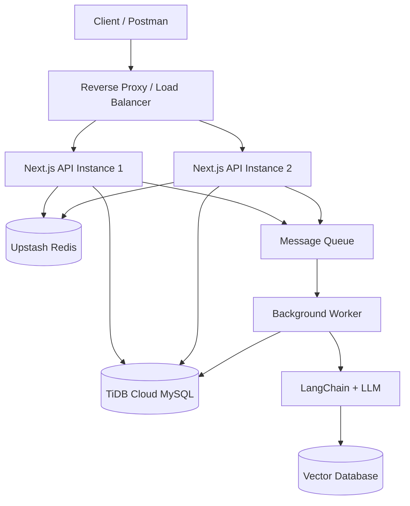

# AI URL Shortener

An industry-focused URL shortener built to practise **backend engineering, system design, security, scalability, TypeScript, and AI/RAG workflows**.

This project is not only a URL-shortening application. It is a practical learning project where each feature is designed to demonstrate a real backend concept, including stateless authentication, Redis-backed rate limiting, caching, database indexing, background processing, horizontal scaling, and AI-powered URL analysis.

> **Project principle:** Build the system step by step, understand every architectural decision, and prefer correctness and security over shortcuts.

## Project Goals

The primary goal is to build a production-style URL shortener while learning how modern backend systems work internally. The project focuses on writing clean, maintainable TypeScript and understanding why each layer, database field, Redis key, HTTP status, and security check exists.

The project is being developed as a hands-on learning experience. Features are implemented gradually, tested with Postman, reviewed for security, and connected back to system-design concepts such as horizontal scaling, caching, queues, consistency, and fault tolerance.

## Planned Features

- User registration and login.

- Secure password hashing with bcrypt.

- Stateless JWT authentication.

- Short-lived access tokens and rotating refresh tokens.

- HttpOnly authentication cookies.

- Redis-backed refresh-token revocation.

- Atomic refresh-token consumption using Redis Lua scripts.

- Login and registration rate limiting.

- URL creation, ownership, update, and deletion.

- Collision-safe short-code generation.

- Fast public redirects using Redis cache-aside caching.

- URL expiry support.

- Click analytics for country, city, device, browser, and time.

- Background analytics processing through a message queue.

- AI-generated URL titles, summaries, and categories.

- LangChain-based content processing.

- RAG-based semantic search over URL content.

- Role-based and resource-level authorization.

- Horizontal scaling with multiple API instances.

- Reverse proxy and load-balancer deployment.

## Technology Stack

| Layer | Technology | Responsibility |
| --- | --- | --- |
| Application | Next.js App Router | Web application and API route handlers |
| Language | TypeScript | Type safety and maintainable application code |
| Database | TiDB Cloud MySQL | Persistent source of truth |
| ORM | Prisma | Type-safe database access and schema management |
| Cache and shared state | Upstash Redis | Caching, rate limiting, and refresh-token storage |
| Validation | Zod | Runtime request validation and inferred TypeScript types |
| Password security | bcryptjs | Password hashing and comparison |
| Authentication | JWT | Stateless access-token authentication |
| API testing | Postman | Manual API and security testing |
| AI orchestration | LangChain | AI chains and retrieval workflows |
| Vector storage | To be selected | Embedding storage and semantic retrieval |
| Queue | To be selected | Asynchronous analytics and AI processing |

## High-Level Architecture



The architecture is designed for **horizontal scaling**. Multiple application instances can run behind a reverse proxy or load balancer because authentication state, rate-limit counters, cache entries, and refresh sessions are stored in shared services rather than in local server memory.

## Application Layers

```
app/
  api/                       HTTP route handlers

src/
  controllers/               Request coordination layer
  services/                  Business logic
  middleware/                Request authentication helpers
  lib/                       Prisma and Redis clients
  utils/                     Reusable utilities
  ai/                        LangChain and RAG logic
  workers/                   Background processing
  types/                     Shared TypeScript types

prisma/
  schema.prisma              Database schema
```

### Route Layer

The route layer receives HTTP requests, reads request data, calls the appropriate controller or service, and returns an HTTP response. It should not contain complex business rules.

### Controller Layer

The controller layer coordinates request-level work. It connects HTTP concerns with application services and helps keep route handlers small and readable.

### Service Layer

The service layer contains business rules. Examples include registering a user, authenticating a login, creating a short URL, checking URL ownership, and rotating refresh tokens.

### Utility Layer

Utilities provide reusable behavior such as API responses, API errors, Zod schemas, JWT helpers, cache functions, rate limiting, and asynchronous error handling.

### Data Layer

Prisma communicates with TiDB Cloud MySQL. The database is the source of truth for users, URLs, analytics, and AI metadata. Redis improves speed and stores shared temporary state, but it does not replace database constraints.

## Database Models

### User

Stores the user identity, name, normalized unique email, password hash, and timestamps.

### Url

Stores the destination URL, unique short code, owner, click count, optional expiry, and timestamps.

### Analytics

Stores click-level information such as country, city, device, browser, and click time.

### AiMetadata

Stores AI-generated title, summary, category, vector ID, and processing time for a URL.

## Authentication Flow

```
Register
  → validate input
  → normalize email
  → hash password
  → create user in TiDB
  → return safe user data

Login
  → validate input
  → find user
  → compare password with bcrypt
  → issue access token
  → issue refresh token
  → store hashed refresh-token reference in Redis

Protected request
  → read Authorization Bearer token or access cookie
  → verify JWT signature and expiry
  → obtain user ID from sub claim
  → continue to protected route

Refresh
  → verify refresh JWT
  → atomically compare and delete old Redis token
  → issue new access and refresh tokens
  → store new refresh-token reference

Logout
  → read refresh token cookie
  → delete its hashed Redis reference
  → expire access and refresh cookies
```

Access tokens are short-lived. Refresh tokens are rotated and stored in Redis by hash rather than as raw token values. The atomic compare-and-delete operation prevents the same refresh token from being successfully consumed by two simultaneous requests.

## Caching Strategy

The main cache use case is the public redirect path:

```
Request /abc123
      ↓
Read url:short:abc123 from Redis
      ↓
Cache hit  → redirect immediately
Cache miss → read TiDB → save in Redis → redirect
```

The database remains authoritative. When a URL is updated or deleted, the related Redis cache key must be invalidated to prevent stale redirects.

## Rate Limiting Strategy

Rate limiting is implemented with Redis because all application instances must share the same counters. The current design uses a fixed-window counter and an atomic Lua script for increment and expiry behavior.

Example policy:

```
Registration: 5 requests per 15 minutes per IP
Login:        8 requests per 15 minutes per IP
```

When the limit is exceeded, the API returns `429 Too Many Requests`. Redis failures are treated separately from a normal rate-limit rejection so the application can make an explicit availability decision.

## Security Principles

- Passwords are never stored in plaintext.

- Password hashes are never returned to clients.

- Login failures use generic messages to reduce account enumeration.

- JWT payloads contain minimal identity information.

- Passwords, password hashes, and secrets are never placed inside JWTs.

- Refresh tokens are rotated and revocable.

- Refresh-token Redis keys contain hashes rather than raw tokens.

- Protected routes verify token signature and expiry.

- Resource ownership is checked before update or delete operations.

- Database unique constraints remain the final protection against duplicate records.

- Rate limiting is applied before expensive authentication or database work.

- Secrets are loaded from environment variables rather than committed to source control.

- Error responses do not expose stack traces or internal database details.

## Project Status

### Completed

- Next.js, TypeScript, App Router, and project structure.

- TiDB Cloud MySQL connection through Prisma.

- Redis connection through Upstash.

- Prisma schema for users, URLs, analytics, and AI metadata.

- API response and API error utilities.

- Asynchronous error-handler utility.

- Generic Redis cache utility.

- Redis-backed registration and login rate limiting.

- Atomic rate-limit Lua script.

- User registration service and route.

- Zod registration and login validation.

- bcrypt password hashing.

- Login and JWT token flow.

- Refresh-token rotation with Redis storage.

- Atomic refresh-token compare-and-delete operation.

- Logout flow that revokes the refresh token and clears authentication cookies.

- Initial Postman testing for route responses and rate limiting.

### Current Learning Stage

The current stage is authentication middleware. The next practical task is to build a protected test route such as:

```
GET /api/auth/me
```

This route will verify the access token, identify the current user, and return a safe user identity. It will then be tested with valid, missing, malformed, invalid, and expired tokens.

### Next Roadmap

1. Complete authentication middleware and protected-route testing.

1. Add resource-level authorization and URL ownership checks.

1. Build URL creation and short-code generation.

1. Add database indexes based on actual query patterns.

1. Build the redirect route with Redis cache-aside logic.

1. Add click analytics.

1. Add a message queue and background worker.

1. Integrate LangChain and RAG for URL analysis.

1. Deploy behind a reverse proxy and run multiple API instances.

1. Perform load, security, and failure-mode testing.

## Local Setup

### Prerequisites

- Node.js 18 or later.

- An npm-compatible package manager.

- TiDB Cloud MySQL database.

- Upstash Redis database.

### Install Dependencies

```bash
npm install
```

### Environment Variables

Create a `.env` file in the project root. Never commit this file.

```
DATABASE_URL="your-tidb-mysql-connection-string"
UPSTASH_REDIS_REST_URL="your-upstash-redis-rest-url"
UPSTASH_REDIS_REST_TOKEN="your-upstash-redis-rest-token"
JWT_SECRET="your-long-random-jwt-secret"
JWT_ACCESS_EXPIRES_IN="15m"
JWT_REFRESH_EXPIRES_IN="7d"
NODE_ENV="development"
```

Use the actual environment-variable names expected by the current project files. Do not share secret values in issues, screenshots, Postman exports, or chat messages.

### Prisma Commands

```bash
npx prisma generate
npx prisma db push
```

Use the command that matches the current database workflow. Always review schema changes before pushing them to a shared or production database.

### Run the Development Server

```bash
npm run dev
```

The application normally runs at:

```
http://localhost:3000
```

## Initial API Endpoints

| Method | Endpoint | Purpose | Access |
| --- | --- | --- | --- |
| `POST` | `/api/auth/register` | Create a user account | Public |
| `POST` | `/api/auth/login` | Authenticate a user | Public |
| `POST` | `/api/auth/refresh` | Rotate authentication tokens | Refresh cookie required |
| `POST` | `/api/auth/logout` | Revoke refresh session and clear cookies | Current session |
| `GET` | `/api/auth/me` | Verify access token and identify user | Protected |

## Testing Approach

The API is manually tested with Postman before moving to the next feature. Important tests include successful requests, invalid input, duplicate records, missing tokens, malformed tokens, wrong credentials, token rotation, token reuse, logout, and rate-limit boundaries.

For rate limiting, test the configured number of allowed requests and then verify that the next request returns `429`. For refresh-token rotation, verify that the first use succeeds and reuse of the old token returns `401`.

## Learning Outcomes

By completing this project, the student should be able to explain and implement:

- Clean separation between routes, controllers, services, utilities, and data access.

- Authentication and authorization.

- JWT access and refresh tokens.

- Password hashing and secure credential handling.

- Redis caching and cache invalidation.

- Distributed rate limiting.

- Database constraints and indexing.

- Transactions and ACID concepts.

- Asynchronous jobs and workers.

- Horizontal scaling and stateless application design.

- Reverse proxies and load balancers.

- LangChain pipelines and RAG retrieval.

- Security testing and failure handling.

## Project Philosophy

This project is intentionally built gradually. The objective is not to produce a large codebase as quickly as possible. The objective is to understand the system deeply enough to explain each architectural decision and implement it independently.

> **Build it. Break it. Test it. Understand it. Improve it.**

## License

This project is created for educational and portfolio purposes and is licensed under the MIT License. You are free to use, modify, and distribute this project in accordance with the license terms.
